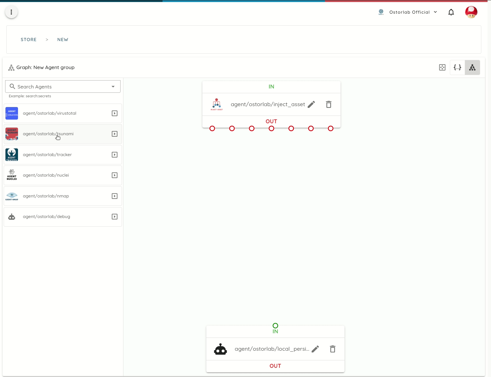
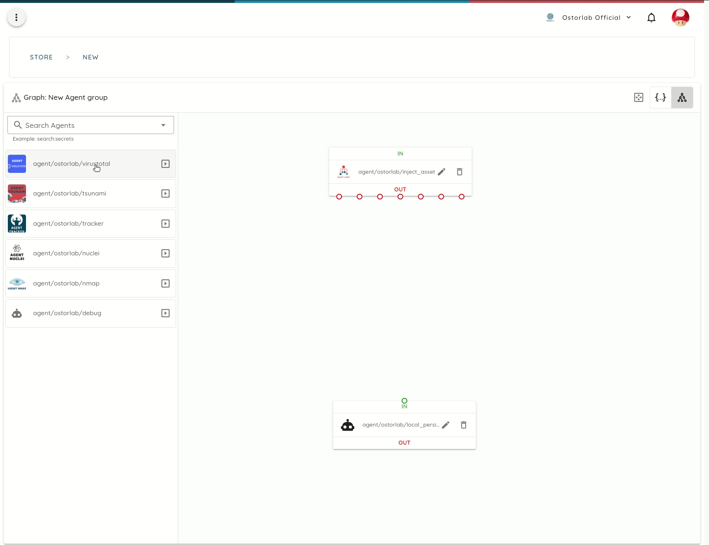

[](https://badge.fury.io/py/ostorlab)
[](https://pepy.tech/project/ostorlab)
[](https://blog.ostorlab.co/)
[](https://twitter.com/ostorlabsec)

# Ostorlab Security Scanner

Ostorlab is security scanner framework with the mantra of do one thing and do it well.

Ostorlab provides unparalleled and limitless extensibility by combining specialized tools to work cohesively to find
vulnerabilities.


# Requirements

Docker is required to run scans locally. To install docker, please follow these
[instructions](https://docs.docker.com/get-docker/).

# Installing

Ostorlab ships as a Python package on Pypi. To install it, simply run the following command if you have `pip` already
installed.

```shell
pip install -U ostorlab
```

# Getting Started

Ostorlab ships with a store that boasts dozens of agents, from network scanning agents like nmap, openvas, nuclei or
tsunami,
web scanner like Zap, web fingerprinting tools like Whatweb and Wappalyzer, DNS brute forcing like Subfinder and Dnsx,
malware file scanning like Virustotal and much more.

To run any of these tools combined, simply run the following command:

```shell
ostorlab scan run --install --agent agent/ostorlab/nmap --agent agent/ostorlab/openvas --agent agent/ostorlab/tsunami --agent agent/ostorlab/nuclei ip 8.8.8.8
```

This command will download and install the following scanning agents:

* `agent/ostorlab/nmap`
* `agent/ostorlab/tsunami`
* `agent/ostorlab/nuclei`
* `agent/ostorlab/openvas`

And will scan the target IP address `8.8.8.8`.

Agents are shipped as standard docker images.

To check the scan status, run:

```shell
ostorlab scan list
```

Once the scan has completed, to access the scan results, run:

```shell
ostorlab vulnz list --scan-id <scan-id>
ostorlab vulnz describe --vuln-id <vuln-id>
```

# Examples

Agents accept argument to tweak their behavior, like setting the default ports for nmap or passing the API key to
Virustotal. Agents composition can also be saved to a YAML file for latter use. See below some examples

* Run a network scan:

```yaml
# file: agent_group.yaml
kind: AgentGroup
description: Grouping of 6 agents.
agents:
  - key: agent/ostorlab/nmap
    args:
      - name: ports
        type: string
        description: List of ports to scan.
        value: '22,443,80'
  - key: agent/ostorlab/tsunami
    args: [ ]
  - key: agent/ostorlab/openvas
    args: [ ]
  - key: agent/ostorlab/nuclei
    args:
      - name: template_urls
        type: array
        description: List of template urls to run. These will be fetched by the agent
          and passed to Nuclei.
        value: ""
      - name: use_default_templates
        type: boolean
        description: use nuclei's default templates to scan.
        value: true
```

```shell
ostorlab scan run --install -g agent_group.yaml ip 8.8.8.8 8.8.4.4
```

* Run a web scan:

```yaml
# file: agent_group.yaml
kind: AgentGroup
description: Grouping of 4 agents.
agents:
  - key: agent/ostorlab/zap
    args: [ ]
  - key: agent/ostorlab/whatweb
    args: [ ]
```

```shell
ostorlab scan run --install -g agent_group.yaml domain-name example.com
```

* List all subdomains, resolve their IP addresses and run a network scan:

```yaml
# file: agent_group.yaml
kind: AgentGroup
description: Grouping of 5 agents.
agents:
  - key: agent/ostorlab/nmap
    args: [ ]
    port_mapping: [ ]
  - key: agent/ostorlab/subfinder
    args: [ ]
  - key: agent/ostorlab/dnsx
    args: [ ]
```

```shell
ostorlab scan run --install -g agent_group.yaml domain-name example.com
```

* Brute force all TLDs of a subdomain and resolve their IP addresses:

```yaml
# file: agent_group.yaml
kind: AgentGroup
description: Grouping of 5 agents.
agents:
  - key: agent/ostorlab/nmap
    args: [ ]
  - key: agent/ostorlab/all_tlds
    args: [ ]
  - key: agent/ostorlab/subfinder
    args: [ ]
  - key: agent/ostorlab/dnsx
    args: [ ]
```

```shell
ostorlab scan run --install -g agent_group.yaml domain-name example.com
```

## The Pitch

Testing for even the most simple vulnerabilities often requires chaining multiple tools. Take for instance scanning
for a Log4J bug, this requires:

* Crawling
* Path brute forcing
* Request Injection Point fuzzing
* Callback interception

Tools will often re-invent the wheel by poorly re-implementing all of these and then add their detection. These often
results in poor detectors as most of these are complex tasks that requires specialized tools.

Ostorlab offers the ease of chaining the specialized tools to focus on perform the required task, offering increased
detection, faster delivery.

To do that, Ostorlab provides on the following:

* A simple, yet powerful SDK to make simple cases effortless while supporting the complex one, like distributed locking,
  QPS limiting, multiple instance parallelization ...
* A battle-tested framework that has been powering Ostorlab Platform for years and used to perform complex dynamic
  analysis setup and demanding static analysis workloads running on multiple machines.
* Performant and scalable design, thanks to the use of message queue with dynamic routing, binary and compact message
  serialisation with protobuf, universal file format using docker image and resilient deployment thanks to docker swarm.
* A store of agents that makes it easy to use and discover tools to add your toolset.
* An automated builder to take the hassle away of building and publishing.
* A GUI to prepare and write down your tool collection setup.
* Focus on documentation, multiple tutorials and upcoming videos and conference presentations.
* A ready to use one-click template repo to get started.

# Assets

Ostorlab supports scanning of multiple asset types, below is the list of currently supported:

| Asset       | Description                                                                        |
|-------------|------------------------------------------------------------------------------------|
| agent       | Run scan for agent. This is used for agents scanning themselves (meta-scanning :). |
| ip          | Run scan for IP address or an IP range .                                           |
| link        | Run scan for web link accepting a URL, method, headers and request body.           |
| file        | Run scan for a generic file.                                                       |
| android-aab | Run scan for an Android .AAB package file.                                         |
| android-apk | Run scan for an Android .APK package file.                                         |
| ios-ipa     | Run scan for iOS .IPA file.                                                        |
| domain-name | Run scan for Domain Name asset with specifying protocol or port.                   |

# The Store

Ostorlab lists all agents on a public store where you can search and also publish your own agents.


In addition, the store, a graphical agent group builder is also available to compose multiple agents and see how
they would interact with each other.



The builder also helps with generating the agent group YAML file to set special arguments that can be passed to agents
to control their behavior.



# Publish your first Agent

To write your first agent, you can check out a full
tutorial [here](https://docs.ostorlab.co/tutorials/write-an-ostorlab-agent/).

The steps are basically the following:

* Clone a template agent with all files already setup.
* Change the `template_agent.py` file to add your logic.
* Change the `Dockerfile` adding any extra building steps.
* Change the `ostorlab.yaml` adding selectors, documentation, image, license.
* Publish on the store.
* Profit!

Once you have written your agent, you can publish it on the store for others to use and discover it. The store
will handle agent building and will automatically pick up new releases from your git repo.


## Ideas for Agents to build

Implementation of popular tools like:

* [semgrep](https://github.com/returntocorp/semgrep) for source code scanning.
* [nbtscan](http://www.unixwiz.net/tools/nbtscan.html): Scans for open NETBIOS nameservers on your target’s network.
* [onesixtyone](https://github.com/trailofbits/onesixtyone): Fast scanner to find publicly exposed SNMP services.
* [Retire.js](http://retirejs.github.io/retire.js/): Scanner detecting the use of JavaScript libraries with known
  vulnerabilities.
* [snallygaster](https://github.com/hannob/snallygaster): Finds file leaks and other security problems on HTTP servers.
* [testssl.sh](https://testssl.sh/): Identify various TLS/SSL weaknesses, including Heartbleed, CRIME and ROBOT.
* [TruffleHog](https://github.com/trufflesecurity/truffleHog): Searches through git repositories for high entropy
  strings and secrets, digging deep into commit history.
* [cve-bin-tool](https://github.com/intel/cve-bin-tool): Scan binaries for vulnerable components.
* [XSStrike](https://github.com/s0md3v/XSStrike): XSS web vulnerability scanner with generative payload.
* [Subjack](https://github.com/haccer/subjack): Subdomain takeover scanning tool.
