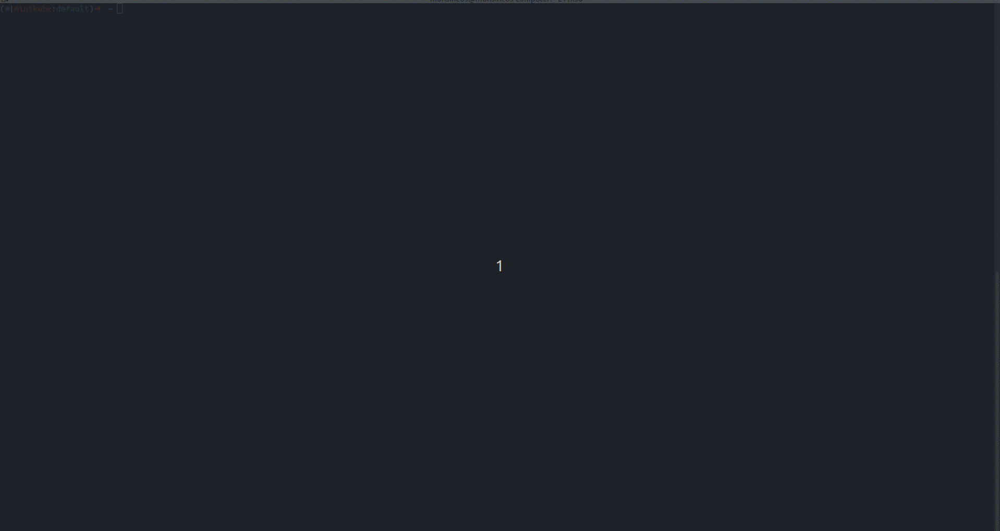

[](https://badge.fury.io/py/ostorlab)
[](https://pepy.tech/project/ostorlab)
[](https://blog.ostorlab.co/)
[](https://twitter.com/ostorlabsec)

# OXO Scan Orchestration Engine

OXO is a security scanning framework built for modularity, scalability and simplicity.

OXO Engine combines specialized tools to work cohesively to find vulnerabilities and perform actions like recon, enumeration, fingerprinting ...


* [Documentation](https://oxo.ostorlab.co/docs)
* [Agents Store](https://oxo.ostorlab.co/store)
* [CLI Manual](https://oxo.ostorlab.co/docs/manual)
* [Examples](https://oxo.ostorlab.co/tutorials/examples)



# Requirements

Docker is required to run scans locally. To install docker, please follow these
[instructions](https://docs.docker.com/get-docker/).

# Installing

OXO ships as a Python package on pypi. To install it, simply run the following command if you have `pip` already
installed.

```shell
pip install -U ostorlab
```

# Getting Started

OXO ships with a store that boasts dozens of agents, from network scanning agents like nmap, openvas, nuclei or
tsunami,
web scanner like Zap, web fingerprinting tools like Whatweb and Wappalyzer, DNS brute forcing like Subfinder and Dnsx,
malware file scanning like Virustotal and much more.

To run any of these tools combined, simply run the following command:

> OXO CLI is accessible using the `oxo` command.

```shell
oxo scan run --install --agent nmap --agent openvas --agent tsunami --agent nuclei ip 8.8.8.8
```

or 

```shell
oxo scan run --install --agent agent/ostorlab/nmap --agent agent/ostorlab/openvas --agent agent/ostorlab/tsunami --agent agent/ostorlab/nuclei ip 8.8.8.8
```


This command will download and install the following scanning agents:

* [agent/ostorlab/nmap](https://oxo.ostorlab.co/store/agent/ostorlab/nmap)
* [agent/ostorlab/tsunami](https://oxo.ostorlab.co/store/agent/ostorlab/tsunami)
* [agent/ostorlab/nuclei](https://oxo.ostorlab.co/store/agent/ostorlab/nuclei)
* [agent/ostorlab/openvas](https://oxo.ostorlab.co/store/agent/ostorlab/openvas)

And will scan the target IP address `8.8.8.8`.

Agents are shipped as standard docker images.

To check the scan status, run:

```shell
oxo scan list
```

Once the scan has completed, to access the scan results, run:

```shell
oxo vulnz list --scan-id <scan-id>
oxo vulnz describe --vuln-id <vuln-id>
```

# Docker Image 
To run `oxo` in a container, you may use the publicly available image and run the following command:  

```shell
docker run -v /var/run/docker.sock:/var/run/docker.sock ostorlab/oxo:latest scan run --install --agent nmap --agent nuclei --agent tsunami ip 8.8.8.8
```

Notes:
* The command starts directly with: `scan run`, this is because the `ostorlab/oxo` image has `oxo` as an `entrypoint`.
* It is important to mount the docker socket so `oxo` can create the agent in the host machine.

# Assets

OXO supports scanning of multiple asset types, below is the list of currently supported:

| Asset       | Description                                                                        |
|-------------|------------------------------------------------------------------------------------|
| agent       | Run scan for agent. This is used for agents scanning themselves (meta-scanning :). |
| ip          | Run scan for IP address or an IP range .                                           |
| link        | Run scan for web link accepting a URL, method, headers and request body.           |
| file        | Run scan for a generic file.                                                       |
| android-aab | Run scan for an Android .AAB package file.                                         |
| android-apk | Run scan for an Android .APK package file.                                         |
| ios-ipa     | Run scan for iOS .IPA file.                                                        |
| domain-name | Run scan for Domain Name asset with specifying protocol or port.                   |

# The Store

OXO lists all agents on a public store where you can search and also publish your own agents.


# Publish your first Agent

To write your first agent, you can check out a full
tutorial [here](https://oxo.ostorlab.co/tutorials/write_an_agent).

The steps are basically the following:

* Clone a template agent with all files already setup.
* Change the `template_agent.py` file to add your logic.
* Change the `Dockerfile` adding any extra building steps.
* Change the `ostorlab.yaml` adding selectors, documentation, image, license.
* Publish on the store.
* Profit!

Once you have written your agent, you can publish it on the store for others to use and discover it. The store
will handle agent building and will automatically pick up new releases from your git repo.


## Ideas for Agents to build

Implementation of popular tools like:

* ~~[semgrep](https://github.com/returntocorp/semgrep) for source code scanning.~~
* [nbtscan](http://www.unixwiz.net/tools/nbtscan.html): Scans for open NETBIOS nameservers on your target’s network.
* [onesixtyone](https://github.com/trailofbits/onesixtyone): Fast scanner to find publicly exposed SNMP services.
* [Retire.js](http://retirejs.github.io/retire.js/): Scanner detecting the use of JavaScript libraries with known
  vulnerabilities.
* ~~[snallygaster](https://github.com/hannob/snallygaster): Finds file leaks and other security problems on HTTP servers.~~
* [testssl.sh](https://testssl.sh/): Identify various TLS/SSL weaknesses, including Heartbleed, CRIME and ROBOT.
* ~~[TruffleHog](https://github.com/trufflesecurity/truffleHog): Searches through git repositories for high entropy~~
  strings and secrets, digging deep into commit history.
* [cve-bin-tool](https://github.com/intel/cve-bin-tool): Scan binaries for vulnerable components.
* [XSStrike](https://github.com/s0md3v/XSStrike): XSS web vulnerability scanner with generative payload.
* ~~[Subjack](https://github.com/haccer/subjack): Subdomain takeover scanning tool.~~
* [DnsReaper](https://github.com/punk-security/dnsReaper): Subdomain takeover scanning tool.

## Credits

As an open-source project in a rapidly developing field, we are always open to contributions, whether it be in the form of a new feature, improved infrastructure, or better documentation.

We would like to thank the following contributors for their help in making OXO a better tool:

* [@jamu85](https://github.com/jamu85)
* [@ju-c](https://github.com/ju-c)
* [@distortedsignal](https://github.com/distortedsignal)
