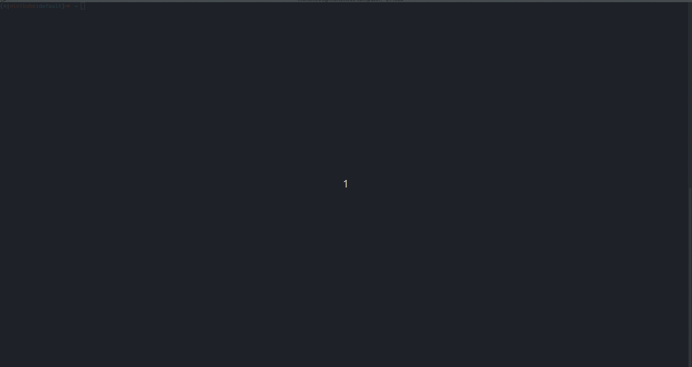

[](https://badge.fury.io/py/ostorlab)
[](https://pepy.tech/project/ostorlab)
[](https://blog.ostorlab.co/)
[](https://twitter.com/ostorlabsec)

# OXO Scan Orchestration Engine

OXO is a security scanning framework built for modularity, scalability, and simplicity.

OXO Engine combines specialized tools to work cohesively to find vulnerabilities and perform actions like recon, enumeration, and fingerprinting.

* [Documentation](https://oxo.ostorlab.co/docs)
* [Agents Store](https://oxo.ostorlab.co/store)
* [CLI Manual](https://oxo.ostorlab.co/docs/manual)
* [Examples](https://oxo.ostorlab.co/tutorials/examples)



# Key Features

* **Modular & Scalable**: Easily combine multiple specialized agents to perform comprehensive scans.
* **Broad Asset Support**: Scan anything from IP addresses and domains to mobile applications (Android, iOS, HarmonyOS) and API schemas.
* **Agent Store**: Access a growing library of community and official agents for popular security tools.
* **Extensible**: Built-in support for creating and publishing your own agents using a simple Python-based framework.
* **API First**: Features a GraphQL API for easy integration into CI/CD pipelines and other automated workflows.

# Requirements

Docker is required to run scans locally. To install Docker, please follow these
[instructions](https://docs.docker.com/get-docker/).

# Installing

OXO ships as a Python package on PyPI. To install it, simply run the following command if you have `pip` already
installed.

```shell
pip install -U ostorlab
```

# Getting Started

OXO ships with a store that boasts dozens of agents, from network scanning agents like Nmap, Nuclei, or Tsunami,
web scanners like ZAP, web fingerprinting tools like WhatWeb and Wappalyzer, DNS brute-forcing tools like Subfinder and Dnsx,
malware file scanning like VirusTotal, and much more.

To run any of these tools combined, simply run the following command:

> OXO CLI is accessible using the `oxo` or `ostorlab` commands.

```shell
oxo scan run --install --agent agent/ostorlab/nmap --agent agent/ostorlab/tsunami --agent agent/ostorlab/nuclei ip 8.8.8.8
```

This command will download and install the following scanning agents:

* [agent/ostorlab/nmap](https://oxo.ostorlab.co/store/agent/ostorlab/nmap)
* [agent/ostorlab/tsunami](https://oxo.ostorlab.co/store/agent/ostorlab/tsunami)
* [agent/ostorlab/nuclei](https://oxo.ostorlab.co/store/agent/ostorlab/nuclei)

It will scan the target IP address `8.8.8.8`.

Agents are shipped as standard Docker images.

# Scan Management

To check the scan status, run:

```shell
oxo scan list
```

Once the scan has completed, to access the scan results, run:

```shell
oxo vulnz list --scan-id <scan-id>
oxo vulnz describe --vuln-id <vuln-id>
```

To stop a running scan, run:

```shell
oxo scan stop --scan-id <scan-id>
```

# Docker Image 
To run `oxo` in a container, you may use the publicly available image and run the following command:  

```shell
docker run -v /var/run/docker.sock:/var/run/docker.sock ostorlab/oxo:latest scan run --install --agent agent/ostorlab/nmap ip 8.8.8.8
```

Notes:
* The command starts directly with: `scan run`, this is because the `ostorlab/oxo` image has `oxo` as an `entrypoint`.
* It is important to mount the Docker socket so OXO can create agents on the host machine.

# On-Prem Scanner Logs

When running OXO as an on-prem scanner, use `--persist-logs` to write scanner logs to disk:

```shell
oxo scanner --scanner-id <scanner-uuid> --persist-logs
```

By default, logs are written to `~/.ostorlab/scanner.log`. To choose another file:

```shell
oxo scanner --scanner-id <scanner-uuid> --persist-logs --log-file /var/log/ostorlab/scanner.log
```

To change the persisted log verbosity:

```shell
oxo scanner --scanner-id <scanner-uuid> --persist-logs --log-level DEBUG
```

# Assets

OXO supports scanning multiple asset types, allowing for comprehensive security coverage across different platforms and protocols.

| Category | Asset | Description |
|----------|-------|-------------|
| **Network** | `ip` | IP address or IP range (v4 and v6). |
| | `domain-name` | Domain name. |
| **Web** | `link` | Web link, accepting a URL, method, headers, and request body. |
| | `api-schema` | API schema (OpenAPI, GraphQL, etc.). |
| **Mobile** | `android-apk` / `android-aab` | Android package files (.APK, .AAB). |
| | `android-store` | Android app in the Google Play Store. |
| | `ios-ipa` | iOS package file (.IPA). |
| | `ios-store` | iOS app in the Apple App Store. |
| | `ios-testflight` | iOS app in TestFlight. |
| | `harmonyos-apk` / `harmonyos-hap` | HarmonyOS package files. |
| **Other** | `file` | Generic file. |
| | `phone-number` | Phone number. |
| | `agent` | Meta-scanning of an agent. |

# The Store

OXO lists all agents on a public store where you can search and also publish your own agents.


# Publish Your First Agent

To write your first agent, you can check out a full
tutorial [here](https://oxo.ostorlab.co/tutorials/write_an_agent).

The steps are basically as follows:

* Clone a template agent with all files already set up.
* Change the `template_agent.py` file to add your logic.
* Change the `Dockerfile` by adding any extra building steps.
* Change the `ostorlab.yaml` by adding selectors, documentation, image, and license.
* Publish it on the store.

Once you have written your agent, you can publish it on the store for others to use and discover it. The store
will handle agent building and will automatically pick up new releases from your Git repo.


## Ideas for Agents to Build

Implementations of popular tools such as:

* ~~[semgrep](https://github.com/returntocorp/semgrep) for source code scanning.~~
* [nbtscan](http://www.unixwiz.net/tools/nbtscan.html): Scans for open NetBIOS name servers on your target’s network.
* [onesixtyone](https://github.com/trailofbits/onesixtyone): Fast scanner to find publicly exposed SNMP services.
* [Retire.js](http://retirejs.github.io/retire.js/): Scanner detecting the use of JavaScript libraries with known
  vulnerabilities.
* ~~[snallygaster](https://github.com/hannob/snallygaster): Finds file leaks and other security problems on HTTP servers.~~
* ~~[testssl.sh](https://testssl.sh/): Identifies various TLS/SSL weaknesses, including Heartbleed, CRIME, and ROBOT.~~
* ~~[TruffleHog](https://github.com/trufflesecurity/truffleHog): Searches through Git repositories for high-entropy~~
  strings and secrets, digging deep into commit history.
* [cve-bin-tool](https://github.com/intel/cve-bin-tool): Scans binaries for vulnerable components.
* [XSStrike](https://github.com/s0md3v/XSStrike): XSS web vulnerability scanner with generative payload.
* ~~[Subjack](https://github.com/haccer/subjack): Subdomain takeover scanning tool.~~
* [DnsReaper](https://github.com/punk-security/dnsReaper): Subdomain takeover scanning tool.
* [Gitleaks](https://github.com/gitleaks/gitleaks): SAST tool for detecting and preventing hardcoded secrets.
* [ffuf](https://github.com/ffuf/ffuf): Fast web fuzzer written in Go.
* [Gobuster](https://github.com/OJ/gobuster): Tool used to brute-force URIs, DNS subdomains, and more.

## Credits

As an open-source project in a rapidly developing field, we are always open to contributions, whether it be in the form of a new feature, improved infrastructure, or better documentation.

We would like to thank the following contributors for their help in making OXO a better tool:

* [@jamu85](https://github.com/jamu85)
* [@ju-c](https://github.com/ju-c)
* [@distortedsignal](https://github.com/distortedsignal)
