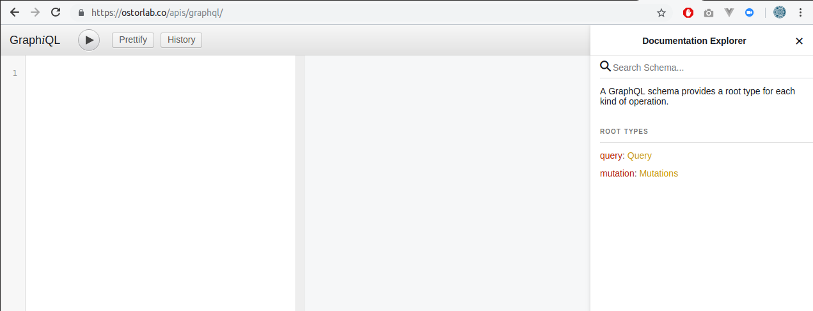

# API

!!! tip
    Ostorlab added support of Universal Binary JSON encoding. UBJSON provides several performance benefits and adds support
    for binary data types. For more information  about the format and available libraries, check out the following
    link [UBJSON Spec](https://ubjson.org/).
    Support for JSON is still available and either can specified using the content type header.

## Overview

Ostorlab provides a GraphQL API to perform all  tasks, from create scan, access scans progress to list vulnerabilities.



GraphQL offers several benefits, like performance, reduced number of requests and removes the need for API versioning.

The next section will describe how to use the API, how to experiment and test it.

If you are not familiar with GraphQL, we recommend [this tutorial](https://www.howtographql.com/) to get familiar with
the technology and syntax.

## Access

### Sandbox

You can use the GraphiQL web application to experiment with the API. GrapiQL is accessible at <https://api.ostorlab.co/apis/graphql>.
The API is accessible to authenticated users only. Make sure you are authenticated at <https://api.ostorlab.co/portal/login/> .


### Scripts

A typical usage of the API is for automation around deployment pipelines or automate the creation and 
monitoring of a large number of scans. 

For the authentication process, you have two options:

- Token based authentication
- API Key authentication

##### Token based authentication

The token can be retrieved from 
`https://api.ostorlab.co/apis/token/` by submitting the username and password. A token linked to the user will be
created. The token is then set in an Authorization header with the value `Token {value}` to authenticate subsequent
requests to `https://api.ostorlab.co/apis/graphql_token`.

```python
import requests
import json


query = '''
query {
  scans {
    scans {   
      id
      title
      progress
    }
  }
}
'''

# Retrieve authentication token.
request = requests.post(url='https://api.ostorlab.co/apis/token/',
                       json={"username":"user1","password":"pass1"})
json_data = json.loads(request.text)
if "token" in json_data:
   token = json_data["token"]
   # Set token in Authorization header.
   headers = {"Authorization": f"Token {token}"}
   # Post query request.
   request = requests.post(url='https://api.ostorlab.co/apis/graphql_token/',
                           json={"query": query},
                           headers=headers)
   print(request.json())
```

##### API Key authentication
The API key can be retrieved from your dashboard `https://report.ostorlab.co`. You need to click on  `Library` then `API keys` menu.
Click the new button to generate a new key and copy the api key (You can add a name and an expiry date to your key), do not forget to click the save button to save your key.

The API key is used as the value of the header's key the key `X-Api-Key` to authenticate subsequent
requests to `https://api.ostorlab.co/apis/graphql_token`.

```python
import requests


query = '''
query {
  scans {
    scans {   
      id
      title
      progress
    }
  }
}
'''


# Set api key in Authorization header.
api_key = "XXXXXXXXXXX"
headers = {"X-Api-Key": f"{api_key}"}
# Post query request.
request = requests.post(url='https://api.ostorlab.co/apis/graphql_token/',
                       json={"query": query},
                       headers=headers)
print(request.json())
```

## Reference

Ostorlab maintains a self documenting scheme, see documentation explorer at the top right corner in the GrapiQL menu.
See also the example section for common queries.

## Examples

### List Scans

To list all the scans owned by the organisation of the current user:

```graphql
query {
  scans {
    scans {   
      id
      title
      progress
    }
  }
}
```


### Scan Details

To retrieve the details of a single scan using its id:
```graphql
query {
  scan(scanId: 26095) {
    id
    title
    assetType
    createdTime
    riskRating
  }
}
```

### Vulnerability Details

To retrieve the list and details of vulnerabilities of a scan:
```graphql
query {
  getScan(scanId: 26095) {
    vulnerabilities {
        vulnerabilities {
          detail {
            title
            description
            recommendation
            cvssV3Vector
          }
          customCvssV3BaseScore
        }
    }
  }
}
```

### Scan Progress

To determine scan current progress stage (scheduled, scanning or done):
```graphql
query {
  scans {
    scans{
      id
      packageName
      progress
    }
  }
}
```

### Create New Scan

To create a scan, files are uploaded as a multipart http request. 

```graphql
mutation newMobileScan($title: String!, $assetType: String!, $application: Upload!, $plan: String!) {
      createMobileScan(title: $title, assetType:$assetType, application: $application, plan: $plan) {
        scan {
            id
        }
      }
    }
```


An example using Python:
```python
import requests
import json

with open('app.apk', 'br') as application:
    query = '''mutation newMobileScan($title: String!, $assetType: String!, $application: Upload!, $plan: String!) {
  createMobileScan(title: $title, assetType:$assetType, application: $application, plan: $plan) {
    scan {
        id
    }
  }
}'''
    data = {
        'operations': json.dumps({'query': query,
                                  'variables': {'title': 'fake_title', 'assetType': 'android', 'application': None,
                                                'plan': 'free'}}),
        'map': json.dumps({
            '0': ['variables.application'],
        })
    }
    resp = requests.post('https://api.ostorlab.co/apis/graphql/', data=data, files={'0': application.read(),}, headers={"Authorization": f"Token {token}"})
```
