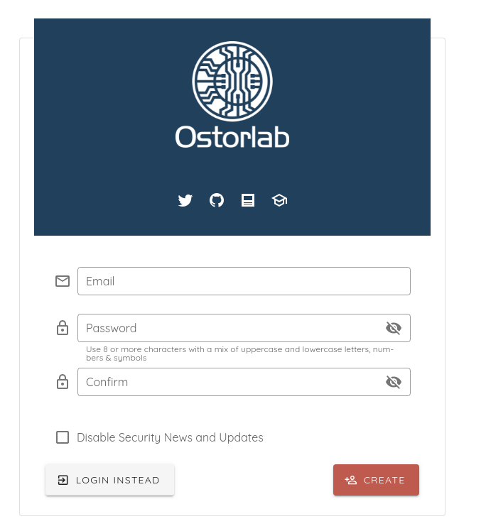
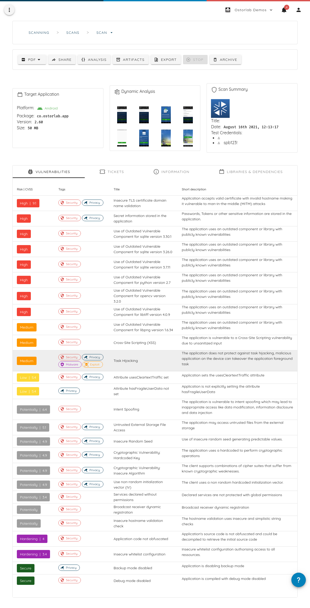
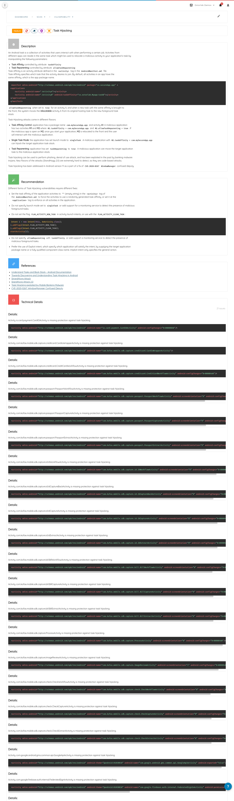
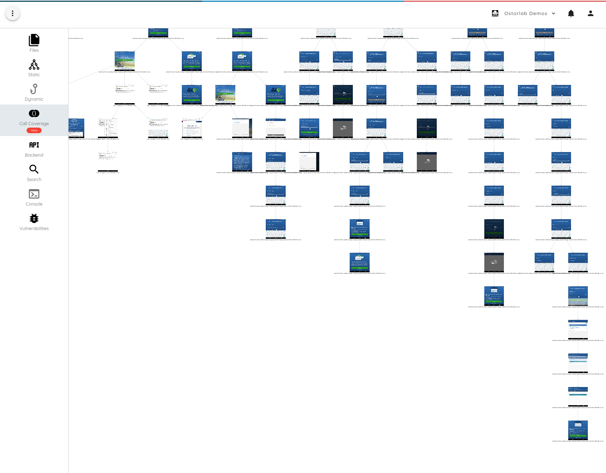
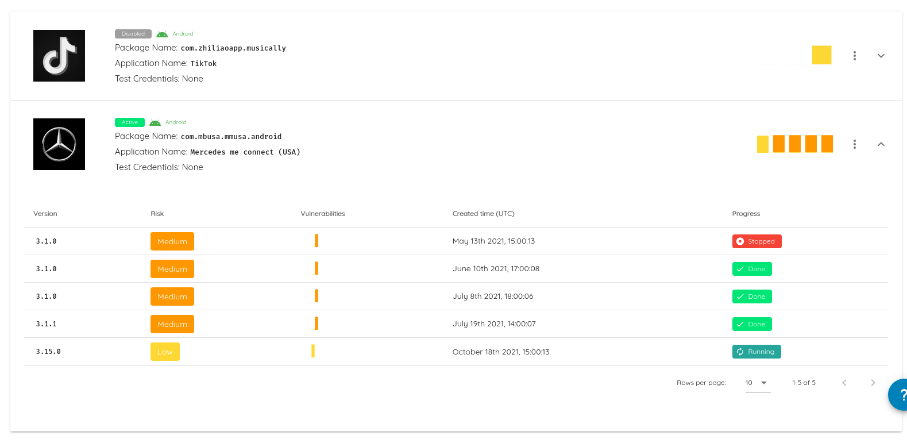
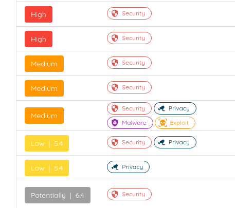

# Guide

## Overview 

Ostorlab is a security and privacy scanner for mobile applications and mobile system backends. 
Ostorlab covers both Android and iOS platforms and can identify over 250 classes of vulnerabilities and over 100.000
outdated vulnerable dependency.

Ostorlab is built from the start to target Mobile Application and uses powerful
static analysis coupled with dynamic and behavioral analysis to ensure high coverage of
the application’s attack surface, and validate findings to enable false-positive free results.

## Getting Started

* Create an account [here](https://report.ostorlab.co/account/new/) using your email address and password and
 validate your account:

* Start a scan by uploading the application and specifying the target platform:

* You can check your scan progress in the [Scanning Section](https://report.ostorlab.co/scan/list), first queued, running and then done:

* While the scan is running, you can already start accessing the scan results:

* You may click on any finding to access detailed reports with recommendation, references and technical details:

* Scans has 3 sections. **Vulnerabilities**: that list actionable findings, **Info**: with information on the application,
like stack traces, taint traces, extracted configuration settings, **Dependency**: List of 3rd party libraries and
frameworks fingerprinted in the application.

* You can also access scan artifacts or generate a PDF report. The report generation runs in the background and a
notification is sent once the report is generated:

* All scans produce a set of artifcats that varies depending on the type scan:

## Continuous Monitoring

Ostorlab enables continuous monitoring of applications on the Android and iOS stores. Continuous monitoring provides a
hassle-free option to assess your application.

Continuous monitoring ensures that:

- all your applications' 3rd party dependencies are vulnerability-free
- fast remediation by ensuring you are the first to get alerted of any newly introduced vulnerability

A scan automatically triggers under the following conditions:

- New version release on the store: Ostorlab check the store continuously to detect updated versions of your
application and triggers a scan.
- Once a week: Ostorlab will scan your application at least once a week, this is useful to cover applications with
silent updates or code push (Microsoft React Native Code Push for instance).

Creating a monitoring rule follows the same steps as creating a scan. You can access the rule details in the
monitoring menu, by clicking on the monitoring rule, you can access the list of created scans. The list
contains the tested version, the risk rating and summary of identified vulnerabilities. You may click on individual
scans to access the full scan report:

Monitoring rules can be disabled to stop the creation of new scans, or fully deleted.

## Authenticated scans

Ostorlab offers support for performing authenticated scans on both the Mobile application and the backend servers. 
Credentials can be set at scan creation using the "Add Test Credentials" menu.

The credentials also include other test parameters like credit card data to perform test payment, address and phone
number to perform test checkouts.

### Complex authentication schemes

Complex authentication schemes like OTP or the random numerical pad are either automated using Appium scripts or
manually performed for one-offs by an Ostorlab support member.

If your application requires custom authentication scheme, please reach out to 
[mailto::support@ostorlab.dev](support@ostorlab.dev) for advice. 

These workflows can be automated using a custom [Appium](http://appium.io/) scripts.
The script integration is for the moment done by Ostorlab team to review code before
integrating it into future scan runs.

## Risk Ratings

Each vulnerability has a risk rating attached. The following is a description of the different categories of risk:

- **High**, **Medium**, **Low**: confirmed vulnerabilities with different risk rating that take into account the impact and complexity. 
- **Hardening**: absence of hardening measure that can prevent and mitigate the impact of certain vulnerabilities.
- **Potentially**: non-confirmed vulnerabilities that may depend on context and usage.
- **Secure**: applies to vulnerabilities and hardening mechanisms, this indicates that tests confirm the absence of the
 vulnerability, or the implementation of the security measure.
- **Important**, **Info**: Information findings that can help with manual assessment, understand application behavior or
 confirm certain aspects of the application, like certificate used to sign the application.

## Architecture

Ostorlab architecture focuses on extensibility without sacrificing robustness and resiliency. This extensibility allows 
Ostorlab team to quickly add and experiment with new scanning capabilities and run at the same time the infrastructure 
responsible for hundreds of thousands of scans with a near-zero maintenance cost.

### Infrastructure

Ostorlab scanner relies on a distributed architecture built to support scalability with a focus on ease of extensibility.
The infrastructure is separated into a Core infrastructure communicating with a set of Universes.

CORE infrastructure is in charge of scan scheduling, reporting, access management, data collection, and monitoring.

A Universe is a group of agents that runs the scan logic. All agents communicate using message queues dedicated to the 
universe and offers each scan a self-contained environment with no interaction with other running scans.

Ostorlab scanner leverages scalability on different levels:

* Agents: Each agent performs a specialized task. Agents can be duplicated to perform repetitive intensive tasks that 
run within a single scan,
* Universe: The scanner runs multiple universes to support handling multiple scans in parallel. All universes are 
separate, stateless, self-contained entities
* Cluster nodes: All scanner components are separate containers that run on a full dedicated cluster. Increasing 
cluster nodes offers straightforward horizontal scalability.

### Updates

Ostorlab updates are managed using a private central registry. Updates are pushed automatically to all of the scanners 
nodes.

Some updates may require human interaction, for instance, updates to the database schema in order to ensure migrations 
has successfully completed and didn’t corrupt any existing data.

### Storage

All data is collected in a central database. All other components are stateless and don’t store any information locally.

### Security

Secret keys and SSL certificates are provisioned using a secret management system accessible from within the cluster.

All the data-in-transit is encrypted and scanned mobile applications are purged right after the scan.

### Access Management

Ostorlab scanner enforces users and groups (organization) access control with a separation of privileges using role.
## Analysis

Ostorlab scanning capabilities use static analysis for high coverage of the attack surface and dynamic analysis for 
false-positive free reports. Ostorlab targets system backends collected during dynamic analysis to identify server-side 
vulnerabilities.

### Static Analysis

Ostorlab’s Static analysis uses multiple techniques to identify vulnerabilities:

#### Configuration Checks

Configuration checks for insecure settings. These settings include Android and iOS native parameters, like
`AndroidManifest.xml` debug and backup mode, Cordova Framework parameters, like Cordova whitelist or debug mode.

For a full list of checks, see [knowledge database entries](/kbvulnz).

#### 3rd Party Dependencies

3rd Party dependencies fingerprints all the application dependencies of all supported frameworks, like native Android, iOS Cocoapods
Cordova Plugins, Xamarin DLL ...

The 3rd Party dependencies also fingerprints statically compiled dependencies and identifies a large set of libraries
like OpenSSL, Zlib, Libjpeg, Libpng, Xerces ....

The fingerprints are matched against known vulnerabilities database. The database contains both publicly reported
vulnerabilities, and a list of non-reported vulnerabilities identified by analyzing public source code repositories.

The vulnerability database is accessible at the [VunlDB](https://www.ostorlab.co/vulndb) menu and can be used to search
for entries by date, name and version.

#### Hardcoded Secrets

The static engine searches for hardcoded secrets, like API Keys that shouldn't be deployed in a mobile application, as well
as passwords, tokens and encryption keys and IV.

Identified secrets are tested for validation and impact by checking permissions, roles and accessible services.

#### Taint Analysis

Ostorlab’s core static technology is its taint engine that computes how taints propagate over several possible 
execution paths. Ostorlab’s static taint engine takes into account object-oriented information and typing information 
to offer a fast, efficient and near false-positive-free taint info. The taint info is then used by dozens of rules to 
identify vulnerabilities, like SQL injection, command injection or use of hardcoded keys.

### Dynamic Analysis

Ostorlab runs mobile applications in an instrumented sandbox to track all interactions with the external environment, 
like network, filesystem, keychain, API, etc.

The instrumentation engine track calls to standard APIs to identify the use of unsafe arguments, like the use of weak 
encryption schemes, unsafe RPC calls, code loading from untrusted path or command execution with user input.

Ostorlab instrumentation is capable of accessing encrypted traffic and does not require bypassing SSL pinning. Collected
 backend is then reused to perform backend analysis.

The dynamic instrumentation uses both system instrumentation techniques, like Fanotify for file system access and a 
custom non-pervasive runtime instrumentation engine, using JDWP and debug APIs for Android and iOS.

This approach compared to pervasive methods, like inline hooking that requires custom memory manipulation is very 
robust offers more capabilities to collect runtime information, particularly for iOS applications built using 
Objective C and SWIFT and don’t require constant maintenance with every new system release that may bring modification 
to the underlying system runtime.

### Backend
Ostorlab targets collected backends during dynamic analysis to identify server-side vulnerabilities. The analysis is 
both passive, like detecting the presence of insecure HTTP headers as well as active, like detecting SQL injection or 
XXE.

Ostorlab active testing uses a probabilistic approach to identify vulnerabilities. This approach has the advantage of 
avoiding the need to send a full payload which could be blocked, limited to a particular OS, may impact the backend 
stability or trigger intrusion detection systems or application firewalls.

Ostorlab backend analysis engine supports a large set of serialization schemes and has supported for nested 
serialization injection.

Probabilistic testing coupled with safe rate-limiting protects backend systems from unexpected failures and unwanted 
denial of service and offers guaranteed false positive free reports.

## Platform Support
	
| Platform | Static Analysis | Dynamic Analysis | Behavioral Analysis | Backend | Analysis Environment Support |
| -------- |-------- |-------- |-------- |-------- | -------- |
| Android Native | Yes | Yes | Yes | Yes | Yes |			
| iOS Native | Yes | Yes | Yes | Yes | Yes |
| Apache Cordova | Yes | Yes | Yes | Yes | Yes |
| Ionic | Yes | Yes | Yes | Yes | Yes |	
| Xamarin | Yes | Yes | Yes | Yes | No |	
| React Native | Yes | Yes | Yes | Yes | Yes |	
| React w/ Javascript Runner | Yes | Yes | Yes | Yes | Yes |	
| Angular w/ Javascript Runner | Yes | Yes | Yes | Yes | Yes |	
| Vue.js w/ Javascript Runner | Yes | Yes | Yes | Yes | Yes |	
| Adobe PhoneGap | Yes | Yes | Yes | Yes | Yes |	
| Framework7 | No | Yes | Yes | Yes | Yes |	
| Apache Weex | No | Yes | Yes | Yes | Yes |	
| NativeScript | Yes | Yes | Yes | Yes | Yes |	
| Flutter | Yes | Yes | Yes | Yes | Yes |	
| Jasonette | Yes | Yes | Yes | Yes | Yes |	

