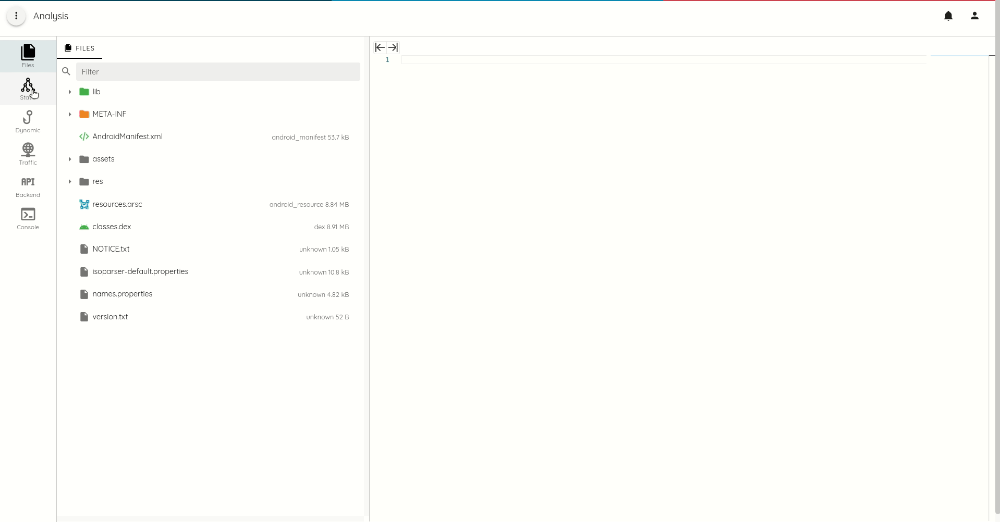
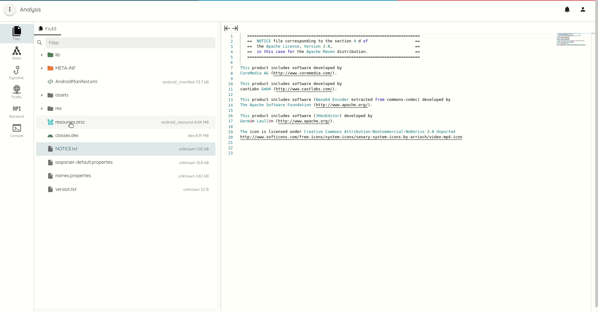

# Analysis

The analysis environment goal is to ease manual assessment and offer the power to write custom checks on top of all the
analyses done by Ostorlab, from taint analysis, dynamic call traces, intercepted traffic, and scanned API requests.



The current release focuses on static analysis and comes with the following features:

* APK and IPA file listing with content access


* Code highlighting for HTML, Javascript, XML, Java, C++


* Binary plist extraction
* Macho and ELF file disassembly and decompilation for ARM and ARM64
* Macho and ELF string listing
* DEX classes listing
* DEX smali listing and java decompilation


* Android resource extraction



* Android manifest extraction


* DEX, Macho, and ELF function call trace analysis with full refs and xrefs generation
* Contextual call trace generation.

## Navigation

The Analysis environment defines 3 sections:

* Parent navigation
* Navigation
* Editor

Parent navigation is split into:

* Files: list of files within the APK or IPA
* Static: static analysis navigation
* Dynamic, Network, API and Console will be available in the next releases.

## Static Analysis


### Search

The search feature in static analysis support multiple keywords, that can be chained together. See the following animation
for an example to search for all sinks method containing the word `mem`:

```json
{
  "search": "mem",
  "sink": "*"
}
```


The list of supported keywords are:

* `search`: arbitrary search within all the method or function attributes.
* `path`: path with the APK or IPA file.
* `package`: package name if applicable.
* `class`: class name if applicable.
* `method`: method name.
* `function`: function name.
* `signature`: method or function signature.
* `sink`: sink category, supports `*` as wildcard.
* `source`: source category, supports `*` as wildcard.
* `privacySource`: privacy source category, supports `*` as wildcard.
* `input`: input category, supports `*` as wildcard.
* `sanitizer`: sanitizer category, supports `*` as wildcard.
* `persistRead`: persist read category, supports `*` as wildcard.
* `persistWrite`: persist write category, supports `*` as wildcard.
* `deprecated`: the function or method is deprecated in the latest API.

### Function and Method tagging

Function tagging helps identify security hotspots. A simple use-case is to find all methods can result in a SQL injection,
use the call trace feature to see where the method is used and if the input is potentially controlled by an attacker:

The tagging  differentiates between:

* **Sink**: over a dozen sink categories. Sinks are functions or method that can lead to vulnerabilities, like execSQL that can lead to SQL injection if input is controlled by the user
* **Source**: Source function and methods return untrusted input that could come from the network, IPC, filesystem (external storage) ...
* **Privacy Source**: Privacy source functions and methods return sensitive input, like user location, SMS, wifi endpoints that can affect the privacy of the user
* **Input**: Input methods are typically overridable methods that serve as callbacks and whose parameters are untrusted and can be manipulated by an attacker. A typical example is content providers query, update, insert, delete, etc methods.
* **Sanitizer**: sanitizer function and methods are used to scrub untrusted input for particular API use.
* **Persist Read and Write**: Persist read and write are helpful to find 2nd order injection vulnerabilities. Read and Write operations are separate.
* **Deprecated**: simply deprecated functions and methods.
