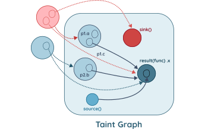
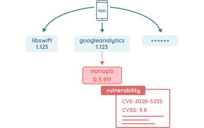

# Technical Capabilities

Powered by static taint analysis, 3rd party dependencies fingerprinting and vulnerability analysis, dynamic 
instrumentation and novel backend scanning capabilities, Ostorlab leads the way providing the most advanced 
vulnerability detection capabilities.

## Configuration Analysis

Configuration analysis checks for the settings of features like debug mode, backup mode, network security policy and
framework specific settings, like Cordova whitelist to detect unsafe values that introduce vulnerabilities or lowers
the security of the application.

## Static Taint Analysis

Taint analysis is a powerful capability that evaluates all execution paths within the application to detect vulnerable
patterns. Taint analysis is capable of detecting vulnerabilities caused by unsafe settings, like the use of weak
cryptographic ciphers, or vulnerabilities caused by accepting untrusted input without validation.

## 3rd Party Vulnerability Detection

Powered by a fingerprinting engine that understands all major frameworks like Cordova, Ionic, Xamarin or React Native
and all popular package management systems, like Gradle, Cocoapods, npm or nuget, Ostorlab is capable of detecting
outdated vulnerable dependencies. Ostorlab also maintains its own vulnerability database providing curated
vulnerability data, correcting and listing unreported vulnerabilities.

## Dynamic Analysis

Dynamic analysis monitors the application's behavior on a real device. Using debug-powered analysis, Ostorlab dynamic
instrumentation supports the latest version of Android and iOS and provides false-positive-free results. Dynamic
analysis also use a monkey-tester (software) to interact with the application and maximise coverage during testing.
Monkey-tester is capable of heuristically identifying login forms, checkout menu or shipping addresses.

## Behavioral Analysis

Behavioral analysis lists the application attack surface and injects it with attack input to detect vulnerabilities.
These vulnerabilities range from SQL injection to memory corruption. Ostorlab behavioral analysis implements advanced
evolutionary approach that provides high coverage within the application.

## XSS Detection

While XSS vulnerabilities still plague web application, it still impacts multi-platform mobile applications as well as
multi-platform backends. Ostorlab XSS detection uses powerful polyglot payloads to detect DOM and reflected XSS
vulnerabilities and uses fuzzing to find postMessage XSS vulnerabilities.

## Backend Vulnerability Analysis

Backend analysis uses API requests collected during dynamic analysis to crawl the backend server, and fuzz it for
vulnerabilities. Ostorlab backend analysis is tailored for mobile application and understands API serialisation
protocols like REST, GraphQL or Protobuf. Backend fuzzing uses a novel approach powered by machine learning, providing
advanced detection capabilities with a very low number of requests.
