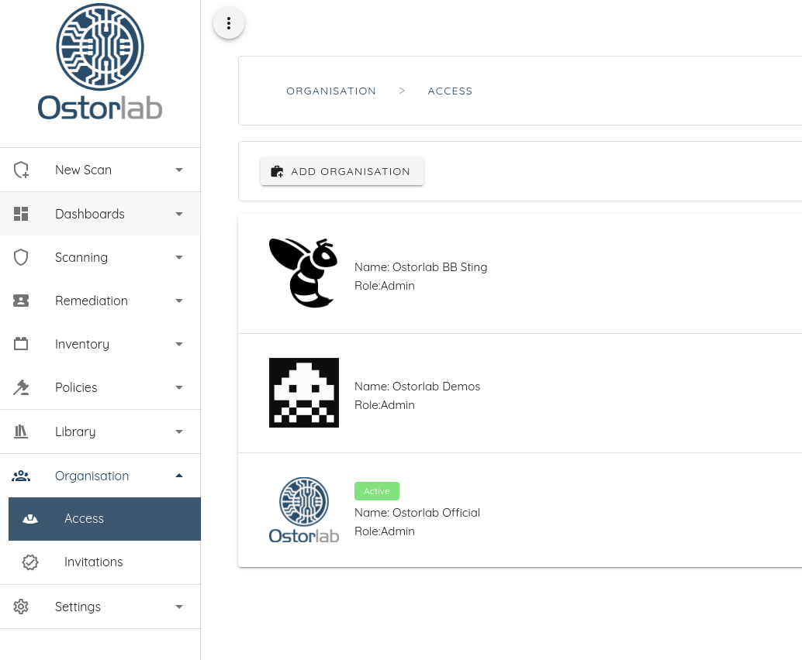
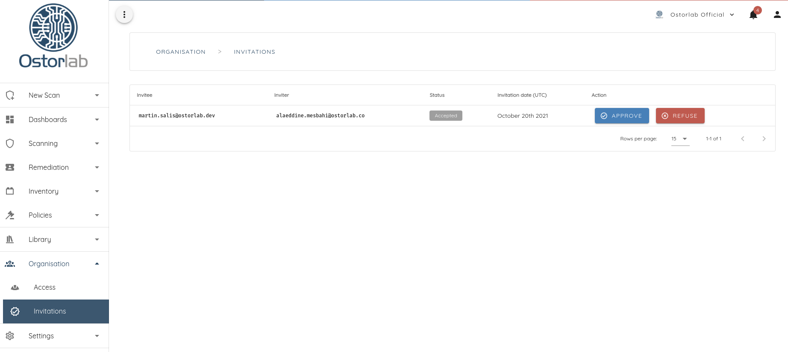
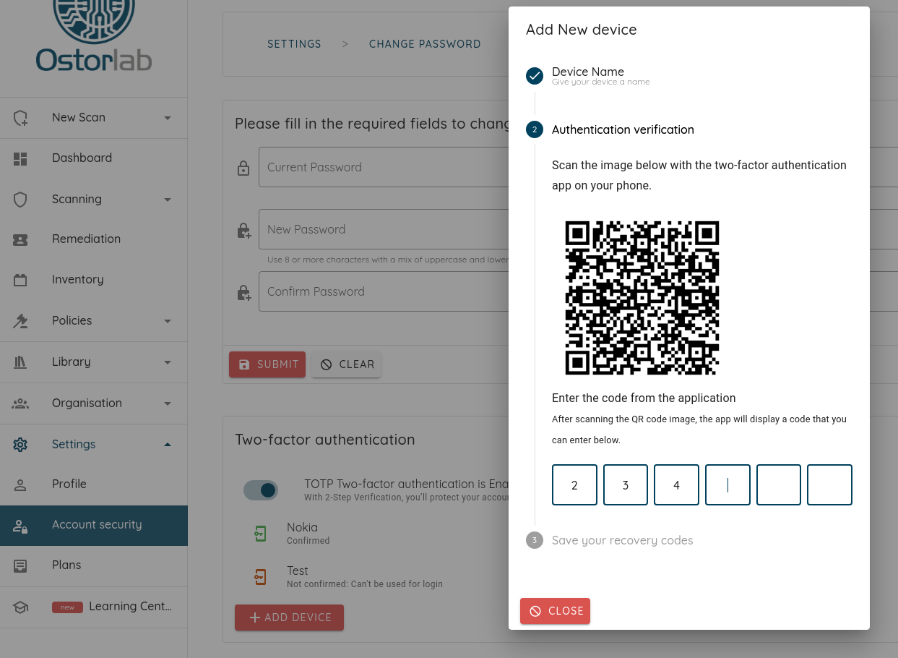

# User Management

Organisations are the entity or workspace that hosts and confines all the Scanning Activity, Monitoring Rules, Assets, Policies, Ticket, Subscriptions, etc.

Organisation management are part of the community platform and offers the following capabilities:

* Multiuser access to the same organisation with Role-based-Access-Control
* Multi-organisation access and the ability to create new ones.
* Add and invite users and manage invitations

## Roles
Ostorlab defines two simple roles to manage access to the platform:

* `ADMIN` : Can manage the organisation access, like adding users, revoking access, changing roles in addition to all the permissions granted to `USER`.
* `USER` : Can create a scan, access results, create monitoring rules and benefit from the all the features of the platform.

Roles can be modified from the [Access Section](https://report.ostorlab.co/organisation/access)

## Add Users

To grant a user access to an organisation, the user can either have an existing account, then the user will be added automatically.
If the use don't have a valid account, an invitation is sent that needs to be approved by and `ADMIN` at the [Invitation Section](https://report.ostorlab.co/organisation/invitations):

## Manage Users and Permissions

Users access can be managed from the users' list expansion panel:

## Switch Organisation

Users can easily switch active organisation from the upper menu:

## Two-factor Authentication

Ostorlab support two-factor authentication based on the time-based one-time password algorithm (TOTP). To enable two-factor
authentication, access the `Account Security` menu from the `Settings` menu. Click on the slider next to enable 2FA and
follow the guided steps.

2FA can be forced on all users in order to be able to join an organisation, to do so, simply enable the flag
`Require Two-Factor Authentication` at the `Organisation` settings menu.

